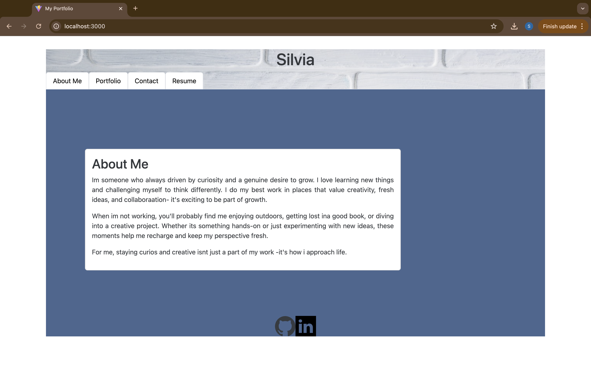
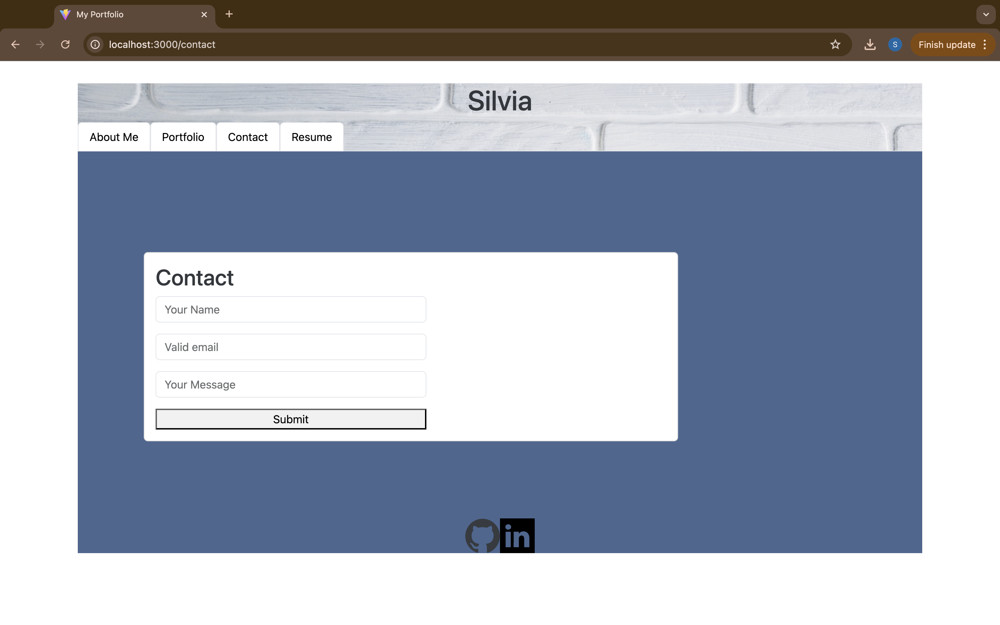
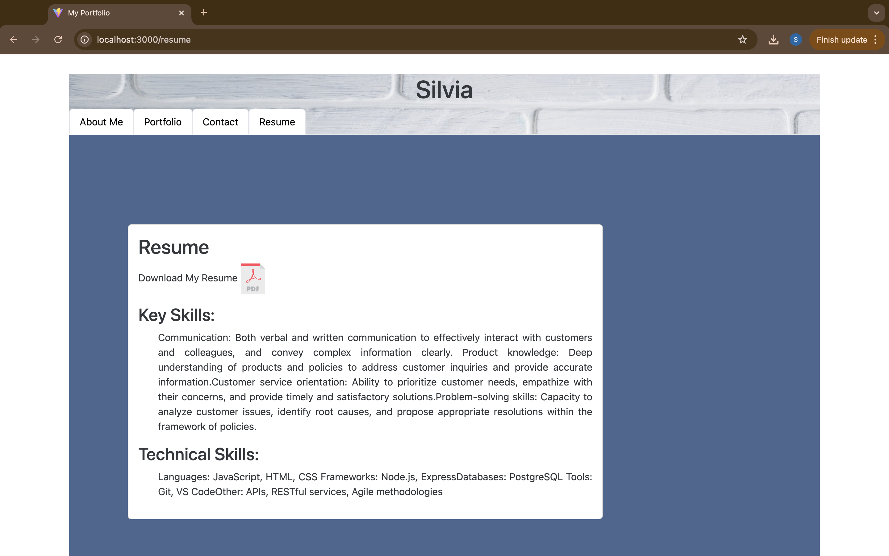

# Twenty-React-Portfolio
Single-page application of deployed React portfolio that conatins work samples

## Deployed Link
--> https://roaring-monstera-3ac101.netlify.app/

## Table of contents 

-[Description](#description)
-[TechnologiesUsed](#techonologies-used)
-[Usage](#usage)

## Description
A single-page application using React to display my portfolio 
Having an About Me, ContactPage, Portfolio, Resume section.
In About Me is the first page of Application with a nav bar at the top with the following options
In Portoflio there will be a glimps of front page my projects with links to my repo url and depolyed url
In Contact Page, user will be able to input a name , email, and message 
In Resume Page user will be able have a glimps of what is contain in my resume with a link to be able to download my resume 
## Techonologies Used
- Node.js
- Express 
- React
- Javascript ,Custom css , JSX
- Bootstarp
## Usage
Main / About Me

Contact

Resume

